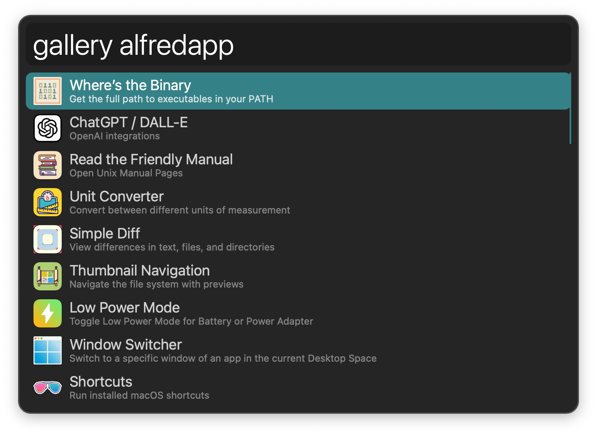

#  Alfred Gallery Alfred Workflow

Search Workflows on the Alfred Gallery

[⤓ Install on the Alfred Gallery](https://alfred.app/workflows/alfredapp/alfred-gallery)

## Usage

Search workflows in the [Alfred Gallery](https://alfred.app/) via the `gallery` keyword.

* <kbd>↩&#xFE0E;</kbd>: Open Gallery page in default browser.
* <kbd>⌃</kbd>: Show tags.
* <kbd>⌘</kbd><kbd>↩&#xFE0E;</kbd>: Install workflow.
* <kbd>⌥</kbd><kbd>↩&#xFE0E;</kbd>: Narrow search to creator’s name.
* <kbd>⌘</kbd><kbd>Y</kbd> (or tap <kbd>⇧</kbd>): Quick Look workflow’s Gallery page.
